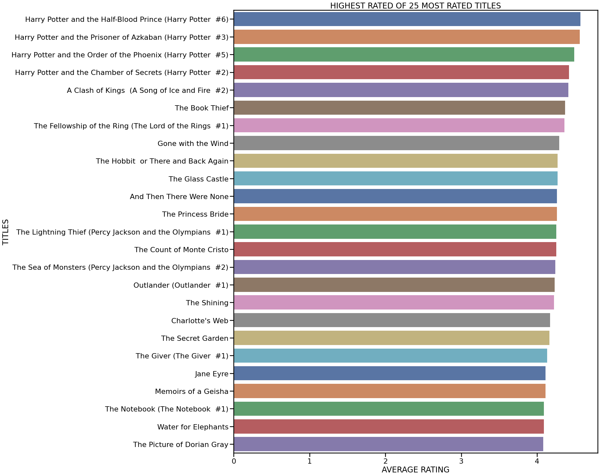
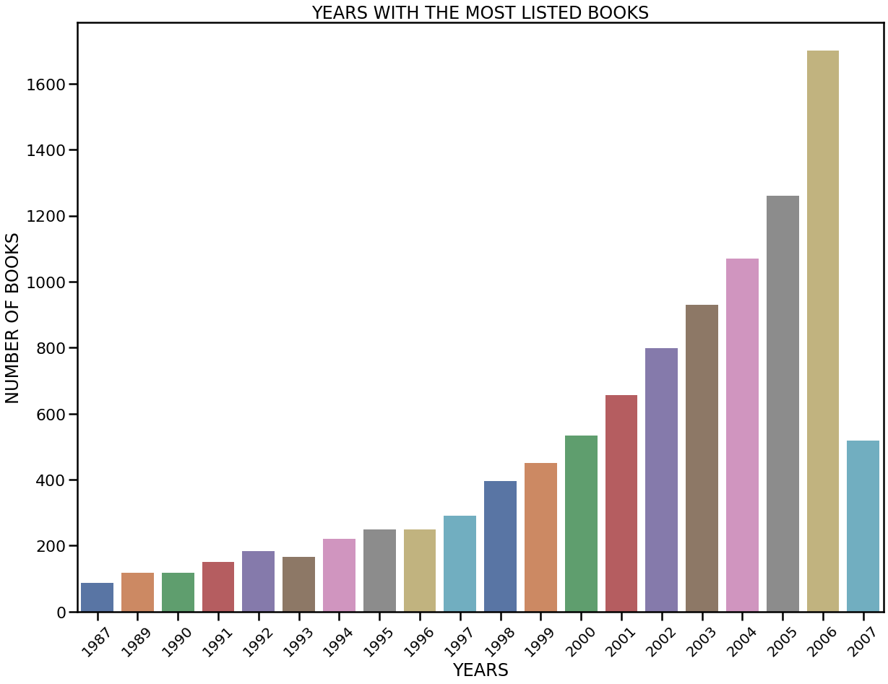

# Goodreads-EDA

## PROJECT DESCRIPTION
The data presented in this dataset will be especially interesting to people who have an affinity for reading books. Goodreads.com is a book catalogue and review site that 
allows users to rate and review books they've read. 

By looking at over 11,000 books in several different langagues by thousands of different authors and publishers we will learn a lot about why certain books continue to have such a profound impact.

## ABOUT THE DATA 

#### SOURCE: 
The data used in this note book comes from Kaggle (https://www.kaggle.com/jealousleopard/goodreadsbooks?select=books.csv)
provided by user Soumik (https://www.kaggle.com/jealousleopard)

## METHODOLOGY

This notebook consists of an exploratory data analysis of the variables presented in the dataset. Among some of the variables are the follwoing:

| HIGHEST RATED BOOKS   | AUTHOR FREQUENCY | YEARS OF HIGHEST RATED BOOKS |
| ------------- |:-------------:| -----:|
|         |            |   |

Both univariate and bivariate analyses were performed to determine any correlating factors. 

## CONCLUSIONS & FUTURE WORK

The Goodreads dataset has a lot of useful information for determining which factors may influence a book's rating and for general exploration of facts about a book.

We were able to look at variables such as publisher, date of publication, number of ratings, number of text reviews, and compare them to the average rating.

In a future version I will add prediction models to the kernel and also explore creating a recommendation system.

Thanks for stopping by!

Milton
